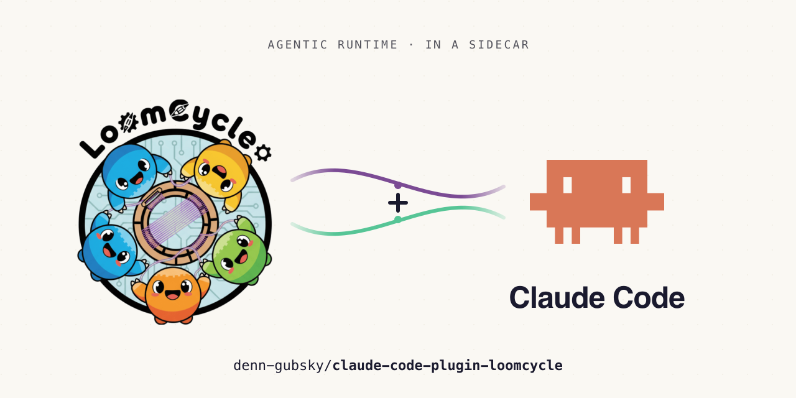

<p align="center">
  
</p>

# loomcycle plugin for Claude Code

Drive a [loomcycle](https://github.com/denn-gubsky/loomcycle) agentic runtime
from inside Claude Code — spawn and cancel runs, list them, snapshot the
runtime, submit evaluations, inspect agent memory, and import `.claude/` repos
— all through slash commands and skills, with no JSON pasting.

This plugin is the **UX layer** over loomcycle's `loomcycle mcp` stdio server.
loomcycle exposes its primitives as MCP meta-tools (`spawn_run`, `cancel_run`,
`list_runs`, snapshot ops, `evaluation`, `agentdef`, …); this plugin pre-wires
that server and wraps the common workflows in operator-friendly commands.

> **Why a plugin and not just `loomcycle mcp install`?** The MCP server is
> plumbing — you'd still have to discover each tool, compose the right `op`
> discriminator, and remember each input schema. The plugin is the kitchen:
> installed once, it pre-wires the server and gives you `/loomcycle:run`,
> `/loomcycle:runs`, etc.

## Prerequisites

- **loomcycle on PATH** (or set `bin_path` at install). The plugin does **not**
  bundle or start the loomcycle binary — install it separately (Homebrew /
  Docker / release binary) and have an instance reachable.
- **A `loomcycle.yaml`** the `loomcycle mcp` server will load.
- Claude Code v2.1+ (plugin support).

## Install

```text
/plugin marketplace add denn-gubsky/claude-code-plugin-loomcycle
/plugin install loomcycle
```

At install you'll be prompted for:

| userConfig | Purpose | Default |
|---|---|---|
| `bin_path` | Path to the loomcycle binary | `loomcycle` (PATH lookup) |
| `base_url` | **Upstream runtime URL** the plugin proxies to — a loomcycle instance must be running here | `http://127.0.0.1:8787` |
| `auth_token` | Bearer sent to the upstream (as `LOOMCYCLE_MCP_UPSTREAM_TOKEN`); its principal governs what the plugin can do. OS keychain, **never** the repo | — |
| `config_path` | *Legacy / reserved* — the thin client loads no config of its own | `loomcycle.yaml` |

The bundled MCP server entry (`.mcp.json`) launches
`loomcycle mcp --upstream <base_url>` automatically when the plugin is enabled.
This is a **thin client** (loomcycle RFC R): it runs a stdio↔`/v1/_mcp` proxy to
the loomcycle runtime already running at `base_url` and **boots no runtime of its
own** — no providers, scheduler, sweepers, or port to bind.

> **Single-runtime invariant.** Earlier versions launched
> `loomcycle mcp --config … --no-http`, which booted a *full second runtime*
> (listener muted) next to your real one. Two runtimes sharing one state each
> have their own in-process event bus, so a resolved interruption or a cancel
> raised on one never wakes a run owned by the other — the source of the
> "session wedged / interruption never resumes" failures. The thin client fixes
> this structurally: there is exactly one runtime, and the plugin is its client.
> **You must have a loomcycle instance running at `base_url`** (start it
> separately via `loomcycle`/`brew services`/Docker); the plugin no longer
> starts one. Requires a loomcycle build that supports `loomcycle mcp --upstream`.

## Commands

All commands are namespaced under the plugin name: `/loomcycle:<command>`.

| Command | Wraps | Purpose |
|---|---|---|
| `/loomcycle:connect [--user=<id>] [--bearer=<tok>] [--base-url=<url>] [--persist]` | (session state) | Set the active loomcycle identity reused by later commands. The bearer is the per-run `user_bearer`, not the API token. |
| `/loomcycle:run <agent> [--user=<id>] <prompt…>` | `spawn_run` | Spawn a run; the result (final text + `agent_id` cancel handle + `run_id`) streams back. |
| `/loomcycle:runs [--user=<id>] [--status=<s>] [--limit=<n>]` | `list_runs` | List recent runs as a table. `user_id` is required (set it once via connect). |
| `/loomcycle:cancel <agent_id> [--reason=<text>]` | `cancel_run` | Cancel a running agent; cascades to sub-agents; idempotent. |
| `/loomcycle:snapshot <create\|list\|restore\|delete> [id]` | the 4 snapshot tools | Runtime snapshot ops from the IDE. Restore/delete confirm first. |
| `/loomcycle:eval <run_id> <score> [--rationale=<text>]` | `evaluation` (`op=submit`) | Record an evaluation against a completed run. loomcycle never auto-promotes on score. |
| `/loomcycle:memory <recall\|search\|add\|get\|set\|list> [--scope=agent\|user] [args…]` | `memory` | Inspect/edit an agent's memory: semantic `recall`/`search`, `add` conversation facts, or plain key/value. `add`/`recall` need a memory-layer backend (v0.16). |
| `/loomcycle:operator-token <create\|rotate\|retire\|get\|list> [--name=<n>] [--tenant=<id>] [--subject=<s>] [--scopes=a,b]` | `operatortokendef` | Mint/rotate/retire per-principal bearer tokens (RFC L multi-tenant auth, loomcycle ≥ v0.17). Operator-admin only; create/rotate show the plaintext **once**. |

## Skills

Skills load automatically when their description matches what you're doing:

| Skill | What it does |
|---|---|
| `loomcycle-spawn-evaluator` | Spawn an independent evaluator agent to score the current transcript or a named run, then offer to record the score. |
| `loomcycle-replay-failed-run` | `get_run` → diagnose the failure → re-spawn with the smallest fix. Stops after a repeat failure and recommends an operator-side config fix. |
| `loomcycle-diff-agentdefs` | Diff two AgentDef versions by `def_id` (`system_prompt` / `allowed_tools` / `max_tokens` / lineage). Descriptive only. |
| `loomcycle-import-claude-code` | Guided wrapper over `loomcycle import claude-code` (RFC C2): dry-run → review the lossy report → `--write` → `validate`. |
| `loomcycle-configure` | Author/tune `loomcycle.yaml` + env: providers, model tiers, `user_tiers`, fallbacks, the env-var catalogue, and six deployment profiles (brew/in-system · containerized · true sandbox · server · multi-tenant · cloud). Never writes the env file — prints the lines. |

## Optional hooks

Both hooks ship **disabled** — they no-op unless you opt in with an env var.

| Hook | Enable with | Action |
|---|---|---|
| capture-run-telemetry | `LOOMCYCLE_PLUGIN_TELEMETRY=1` | Append `{ts, run_id, agent_id}` to `${CLAUDE_PLUGIN_DATA}/run-telemetry.jsonl` after each `spawn_run`. |
| auto-snapshot-on-error | `LOOMCYCLE_PLUGIN_AUTO_SNAPSHOT=1` | On a state-mutating tool error, run `loomcycle snapshot --description pre-error-<ts>`. Needs `LOOMCYCLE_AUTH_TOKEN` (and optionally `LOOMCYCLE_BASE_URL`) exported in the shell that launches Claude Code — the hook reads the bearer from the environment, never from a substituted command string. |

## Multi-tenant authorization, isolation & token rotation

loomcycle v0.17.0 (RFC L) adds per-principal bearer tokens (`OperatorTokenDef`,
`lct_…`), each bound to an authoritative `{tenant_id, subject, scopes}` resolved
**from the token**. How much of that the plugin enforces depends entirely on
**which transport** the bundled MCP server uses:

Since 0.21.0 the default stdio transport is a **thin client** that proxies to the
runtime's `POST /v1/_mcp` — the **same principal-enforced path** as the direct
HTTP transport. So the plugin's authority is governed by the **token's principal
on the upstream**, regardless of transport:

| Transport | What the plugin is | Isolation / scopes |
|---|---|---|
| **stdio thin client** (default `.mcp.json`: `loomcycle mcp --upstream`) | a proxy to the runtime's `/v1/_mcp` | **Principal-enforced by `auth_token`.** An admin token (or an open-mode runtime) → full authority; a scoped `lct_…` token → confined (`applyPrincipal` overrides wider wire values; under-scoped calls get a `scope` refusal; reads tenant-filtered). |
| **HTTP** (`POST /v1/_mcp` direct, see [examples/mcp-http-tenant.json](examples/mcp-http-tenant.json)) | same `/v1/_mcp`, direct transport (no local stdio process) | Same principal enforcement. |

**To confine the plugin to one tenant**, just set `auth_token` to a scoped
`lct_…` bearer in the default config — no `.mcp.json` swap needed any more, since
the default already routes through the principal-enforced `/v1/_mcp`. (The
[HTTP example](examples/mcp-http-tenant.json) remains a valid alternative
transport if you'd rather not run the stdio proxy process.)

### Token rotation runbook

`/loomcycle:operator-token rotate` mints a replacement valid alongside the old
one for the grace window. Two sharp edges to know:

1. **Creating the first admin `OperatorTokenDef` disables the legacy
   `LOOMCYCLE_AUTH_TOKEN`** for inbound HTTP (loomcycle fails closed onto the
   substrate). If `auth_token` is still that legacy value, the HTTP-using
   **auto-snapshot hook** (and the HTTP transport above) will start returning
   401 — update `auth_token` to a valid `lct_…` admin bearer.
2. **A running `loomcycle mcp` captured its token at launch.** After updating
   the `auth_token` userConfig, **restart Claude Code** so the MCP server picks
   up the new bearer. Rotate within the grace window to avoid a gap.

The stdio command surface keeps working across a rotation regardless (stdio is
operator-trust) — only the HTTP-authed paths (the snapshot hook, or the HTTP
transport) depend on a currently-valid bearer.

## Local development

```bash
git clone https://github.com/denn-gubsky/claude-code-plugin-loomcycle
claude --plugin-dir ./claude-code-plugin-loomcycle      # load for one session
claude plugin validate ./claude-code-plugin-loomcycle   # validate before publishing
# optional: shellcheck hooks/scripts/*.sh
```

## Compatibility

| This plugin | loomcycle | Claude Code |
|---|---|---|
| 0.21.0 | **Requires a loomcycle build with `loomcycle mcp --upstream`** (RFC R thin client). The plugin no longer boots a runtime — a loomcycle instance must be running at `base_url`. On a build without `--upstream`, the flag is unknown and the server errors at launch — pin 0.20.x or upgrade loomcycle. | ≥ 2.1 |
| 0.20.2 | as 0.20.1, **plus** the `loomcycle mcp --no-http` flag (verified on v0.22.0). On an older build that doesn't recognise `--no-http`, the server errors at launch — pin 0.20.1 or upgrade loomcycle. | ≥ 2.1 |
| 0.20.1 | ≥ v0.12.x (`loomcycle mcp` + meta-tools); memory `add`/`recall` need ≥ v0.16; `operator-token` needs ≥ v0.17 | ≥ 2.1 |

The plugin's version tracks loomcycle's version vector through the v1.x batch.
All tool contracts are re-verified against loomcycle's `internal/api/mcp/tools.go`
each release — the v0.12.x → v0.16.x meta-tool additions are back-compatible,
so the existing commands work unchanged against any loomcycle ≥ v0.12.x.

The plugin consumes loomcycle's MCP tools verbatim. If a capability is missing,
it's a feature request on the loomcycle repo — the plugin ships no workarounds.

## Troubleshooting

- **MCP server won't connect** — check `loomcycle` is on PATH (or `bin_path` is
  correct) and that `config_path` points at a valid `loomcycle.yaml`. Claude
  Code spawns MCP servers with a sparse environment; if your yaml uses
  `${...}` env placeholders, populate them or wrap the binary in a script that
  sources your env first.
- **An `env` change in `settings.json` / `settings.local.json` didn't take
  effect** — the respawned `loomcycle mcp` server inherits the environment Claude
  Code itself started with, so a `/reload-plugins` does **not** re-read
  `settings`-supplied env (e.g. `LOOMCYCLE_LISTEN_ADDR`,
  `LOOMCYCLE_MCP_ALLOW_PRIVILEGED_TOOLS`). Only a **full Claude Code restart**
  picks up a changed `settings` `env`. (Exporting the var in the shell that
  launches Claude Code, then restarting, is the reliable path.)
- **`list_runs` errors** — it requires `user_id`. Set one via
  `/loomcycle:connect --user=<id>` or pass `--user=` on the command.
- **Bearer / auth** — the API bearer lives in your OS keychain via the
  `auth_token` userConfig, never in the repo. The per-run bearer set by
  `/loomcycle:connect` is a separate, session-scoped value.
- **Multi-replica loomcycle** — the plugin talks to whatever instance its
  `loomcycle mcp` server is configured against; cluster-mode is transparent.

## What this plugin does NOT do

- Start, stop, or health-check loomcycle (lifecycle is the operator's job).
- Bundle the loomcycle binary.
- Push agent definitions *into* loomcycle (that's `loomcycle import claude-code`
  — RFC C2 — the data-movement direction; this plugin moves runtime control).

## License

Apache-2.0. See [LICENSE](LICENSE).
